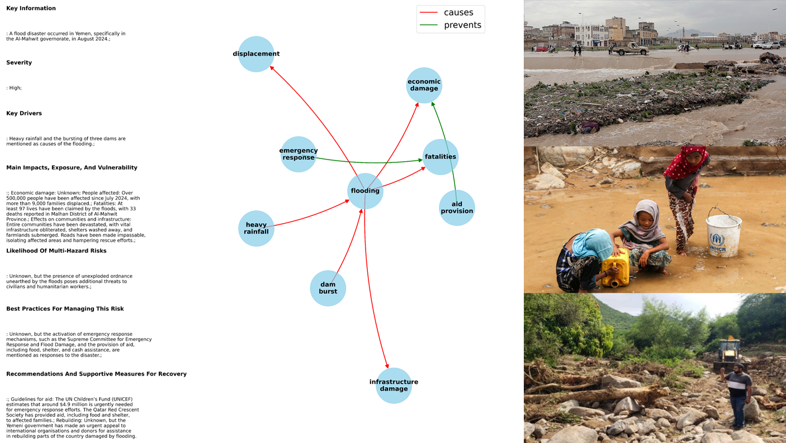

# crisesStorylinesRAG



## Overview

`crisesStorylinesRAG` is a pipeline designed to **augment disaster event information with factual storylines and knowledge graphs** at scale. By combining **Large Language Models (LLMs)** with **Retrieval-Augmented Generation (RAG)** on news data from the **European Media Monitor (EMM)**, we generate structured representations of hazards, impacts, drivers, and responses for each event.

The pipeline produces:

- **Storylines**: coherent textual summaries extracted from multiple news sources  
- **Knowledge Graphs (KGs)**: condensed, structured representations of key causal or preventive relationships between entities in each disaster

This approach enables fast, interpretable insights into global disasters and supports research, situational awareness, and downstream analytical workflows.

---

## Data Sources

### European Media Monitor (EMM)

News articles are retrieved from the [European Media Monitor (EMM)](https://emm.newsbrief.eu/NewsBrief/alertedition/en/ECnews.html), which provides large-scale, near–real-time monitoring of global news. The pipeline uses **semantic search** to retrieve articles relevant to each disaster event.

### EM-DAT

Historical disaster events are sourced from [EM-DAT](https://www.emdat.be/). For each event, basic metadata (disaster type, country, affected location, and date range) are used to guide and constrain the search on EMM.

> **Note:** Although EM-DAT is used in this study, the pipeline is generic and can be applied to any structured list of events with minimal metadata (event type, location, and date).

---

## LLM Models and Access Requirements

All LLM-based processing is performed via the [GPT@JRC service](https://gpt.jrc.ec.europa.eu/).

### Model Used

In our experiments, all LLM calls were executed using:

- **`llama-3.3-70b-instruct`**

This model is used for:

- Generating disaster storylines from retrieved news (RAG)  
- Constructing causal knowledge graphs from the generated storylines

No fine-tuning is required; the pipeline relies entirely on **prompt-based inference**.

### Access Requirements

To run the full pipeline, users must have:

- Valid credentials for the **GPT@JRC** service  
- Authorization to query **`llama-3.3-70b-instruct`** (or a compatible instruction-following LLM)

---

## Conceptual Pipeline Overview

At a high level, `crisesStorylinesRAG` follows a two-stage LLM workflow driven by external evidence:

1. **Evidence retrieval**: Disaster metadata are used to retrieve relevant news articles from EMM via semantic search  
2. **Storyline synthesis (LLM + RAG)**: Retrieved news chunks are summarized into a single, coherent disaster storyline, grounded exclusively in the retrieved evidence  
3. **Knowledge graph construction (LLM)**: The generated storyline is converted into a compact **causal knowledge graph**, focusing on drivers, impacts, and preventive factors  
4. **Independent validation (triplets)**: Factual triplets are extracted and evaluated separately by experts to quantify precision and inter-annotator agreement; these triplets do **not** feed back into storylines or graphs

This ensures interpretability and faithfulness of the main outputs, while enabling rigorous quantitative validation.

---

## Pipeline Workflow (Implementation)

The workflow is implemented in the main script: `emmRAG_pipeline.py`


The steps are:

1. **Input events**:  
   The default input is a structured EM-DAT–derived list of global disasters (2014–2024): ./data/input_emdat_1424.xlsx
   

This file contains:

- Disaster type  
- Country  
- Affected location  
- Event start date  

2. **News retrieval (RAG)**:  
For each event, a semantic query is issued to EMM, for example: What are the latest developments on the {disaster} disaster occurred in {country}
on {month} {year} that affected {location}? 


Retrieved documents are filtered and cleaned to remove spurious or weakly related articles.

3. **Storyline generation (LLM)**:  
A first LLM call generates a structured storyline using a controlled prompt including:

- Key information and severity  
- Main drivers  
- Impacts, exposure, and vulnerability  
- Multi-hazard risks  
- Best practices and recovery recommendations  

The model is instructed to **only use retrieved evidence** and to mark missing details explicitly as *unknown*.

4. **Knowledge graph generation (LLM)**:  
A second LLM call converts the storyline into a causal knowledge graph using in-context learning (ICL), constrained to:

- Two relation types only: `causes` and `prevents`  
- Minimal, non-duplicated nodes  
- Explicit drivers and impacts

5. **Post-processing and storage**:  
Outputs are cleaned and standardized using `postproc.py` and `utils.py`, and stored in: DisasterStory.csv 


---

## How to Run the Pipeline

1. **Set up the environment**

```bash
conda env create -f storylines-env.yml
conda activate storylines-env


 ## Analysis and Reproducibility Notebooks

The repository includes three Jupyter notebooks that reproduce the main figures and analyses presented in the accompanying paper:

- **`1_Plot_Results.ipynb`**  
  Reproduces the core descriptive results of the pipeline, including statistics on generated storylines and knowledge graphs.

- **`2_Coverage_Biases.ipynb`**  
  Analyzes temporal, spatial, and hazard-type coverage of the generated outputs, highlighting potential biases in news availability and retrieval.

- **`3_Validation.ipynb`**  
  Reproduces the expert validation analyses, including triplet precision, inter-annotator agreement (Krippendorff’s α, Cohen’s κ), and agreement distributions, as shown in the validation figures and tables of the paper.

Together, these notebooks provide full transparency and reproducibility of the quantitative results reported in the manuscript.

---

## Interactive Visualization

The repository also includes a lightweight interactive application for exploring generated storylines and knowledge graphs:

- **`app_pyvis_new.py`**  
  A Gradio-based web application for visualizing disaster storylines and their associated knowledge graphs using **PyVis**.

The app allows users to:
- Browse disaster events
- Read generated storylines
- Interactively explore causal knowledge graphs

A live version of the application is publicly available on Hugging Face Spaces:

👉 **https://huggingface.co/spaces/roncmic/crisesStorylinesRAG**

This interface is intended for exploratory analysis, demonstration, and stakeholder engagement rather than large-scale processing.

---

## Reproducibility and Archiving

To ensure full reproducibility and long-term accessibility, the **entire GitHub repository** (including source code, notebooks, configuration files, and documentation) is archived on **Zenodo**, together with the input and output datasets used in the study.

The Zenodo archive includes:
- The EM-DAT–derived input event list (`input_emdat_1424.xlsx`)
- The full pipeline output with storylines and knowledge graphs (`DisasterStory.csv`)
- The expert-annotated triplet validation dataset (`triplet_expert_val.xlsx`)
- The complete source code and Conda environment specification

This makes the project **self-contained** and independently reusable.

---

## Citation

If you use this code, data, or outputs, please cite the following paper:

> **Disaster Storylines and Knowledge Graphs from Global News with Large Language Models and Retrieval-Augmented Generation**  
> Michele Ronco\*, Luca Bandelli, Lorenzo Bertolini, Sergio Consoli, Damien Delforge,  
> Alessio Spadaro, Marco Verile, Christina Corbane  
>  
> *European Commission, Joint Research Centre (JRC), Ispra, Italy*  
> *Engineering Ingegneria Informatica, Roma, Italy*  
> *Institute of Health and Society (IRSS), UCLouvain, Belgium*  
>  
> \*Corresponding author: michele.ronco@ec.europa.eu  
>  
> *Manuscript under review.*

A BibTeX entry will be added upon publication.

 
   
  
## Software Environment

The pipeline is implemented in **Python 3.12** and designed to run within a Conda environment. Development and experiments were conducted using GPU acceleration, though most components can also run on CPU for smaller-scale use.

Key software components include:

- **LLMs & Retrieval-Augmented Generation**
  - `transformers`, `accelerate`, `langchain`
  - `openai`, `tiktoken`
  - `torch` (with optional CUDA support), `deepspeed`, `bitsandbytes`

- **Data processing & evaluation**
  - `pandas`, `numpy`, `scikit-learn`, `scipy`
  - `datasets`, `evaluate`, `bert-score`

- **Knowledge graphs & NLP**
  - `networkx`, `rdflib`, `pykeen`
  - `nltk`, `sentencepiece`, `rapidfuzz`

- **Geospatial processing**
  - `geopandas`, `shapely`, `pyproj`, `rasterio`, `osmnx`

- **Visualization & interfaces**
  - `matplotlib`, `seaborn`, `plotly`, `pyvis`
  - `jupyterlab`, `gradio`, `fastapi`

The **complete list of dependencies and exact package versions** required to reproduce the environment is provided in the Conda environment file (`storylines-env.yml`) included in this repository and archived on Zenodo. This ensures full reproducibility of the pipeline and associated validation experiments.